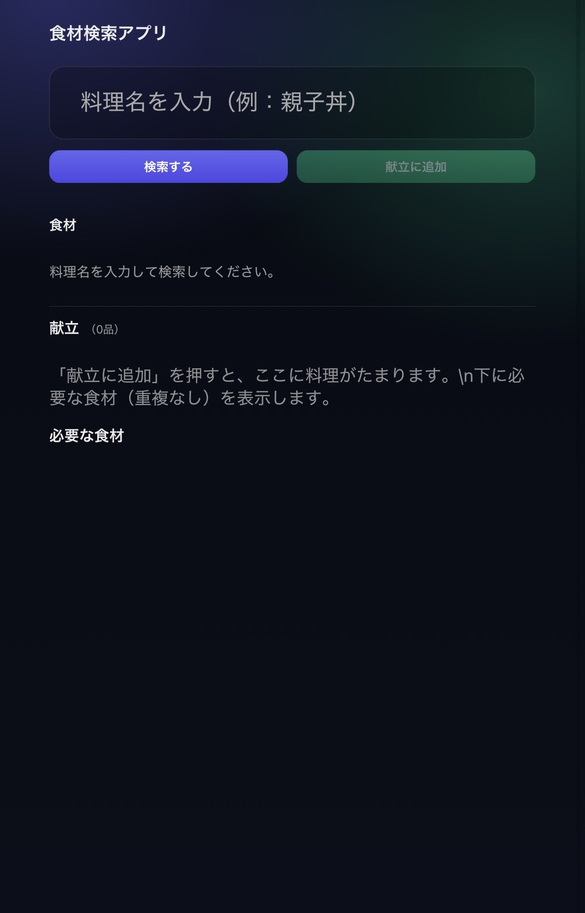

# 🥕 Food Ingredient Search App

Googleスプレッドシートをデータベースとして活用し、  
Google Apps Script（GAS）で構築したサーバーレス型の食材検索Webアプリです。

料理名を検索すると、対応する食材一覧を即座に表示できます。

---

## 📌 Overview

このアプリは、スプレッドシートに登録された

- 料理名
- 使用する食材一覧

をもとに、料理名検索から食材を取得できる軽量Webアプリケーションです。

**サーバーレス構成 × スプレッドシートDB化 × GAS API化**  
という構成で実装しています。

---

## 🚀 Features

### 🔎 料理名検索
- 入力中にリアルタイムで検索候補を表示
- 検索候補は独自実装（ブラウザのネイティブ候補に依存しない）

### 🍅 食材一覧表示
- 検索結果は大きめフォントで表示
- 画面サイズに応じて比率可変（レスポンシブ設計）
- 表示領域を統一したダークテーマUI

---

## 🏗 Architecture

### データベース
- Google Spreadsheet
  - A列：料理名
  - B列：食材

### バックエンド
- Google Apps Script（GAS）
  - `doGet()`：HTML返却
  - `getDishNames()`：料理名一覧取得
  - `getAllRecipes()`：料理 → 食材配列辞書を返却

### フロントエンド
- GAS HTML Service
- Vanilla JavaScript
- CSS（ダークテーマ + レスポンシブ設計）

---

## ⚡ Performance Design

- 初回ロード時に全レシピデータを取得
- クライアント側で辞書化
- 検索処理はフロントエンドで完結
- 通信回数を最小化

---

## 🎯 Technical Decisions

| 技術 | 選定理由 |
|------|----------|
| Google Spreadsheet | 容易にデータ更新可能 |
| Google Apps Script | サーバーレス・低コスト・即時デプロイ可能 |
| フロント側検索処理 | 高速化・通信削減 |
| ダークテーマUI | モバイル視認性向上 |

---

## 🧠 Learning Points

- スプレッドシートをDBとして扱う設計
- GASによるAPI設計
- フロント独自オートコンプリート実装
- UI比率設計によるレスポンシブ最適化

---

## 📦 Deployment

1. Google Apps Script にコードをデプロイ
2. ウェブアプリとして公開
3. URLを共有

---

## 🔮 Future Improvements

- 食材から料理検索（逆引き機能）
- 部分一致・あいまい検索対応
- データ件数増加時のページネーション対応
- Firebaseなどへの拡張
- 料理名直接入力に加え、カテゴリから選択できるUIの実装

---

## 📄 License

MIT
